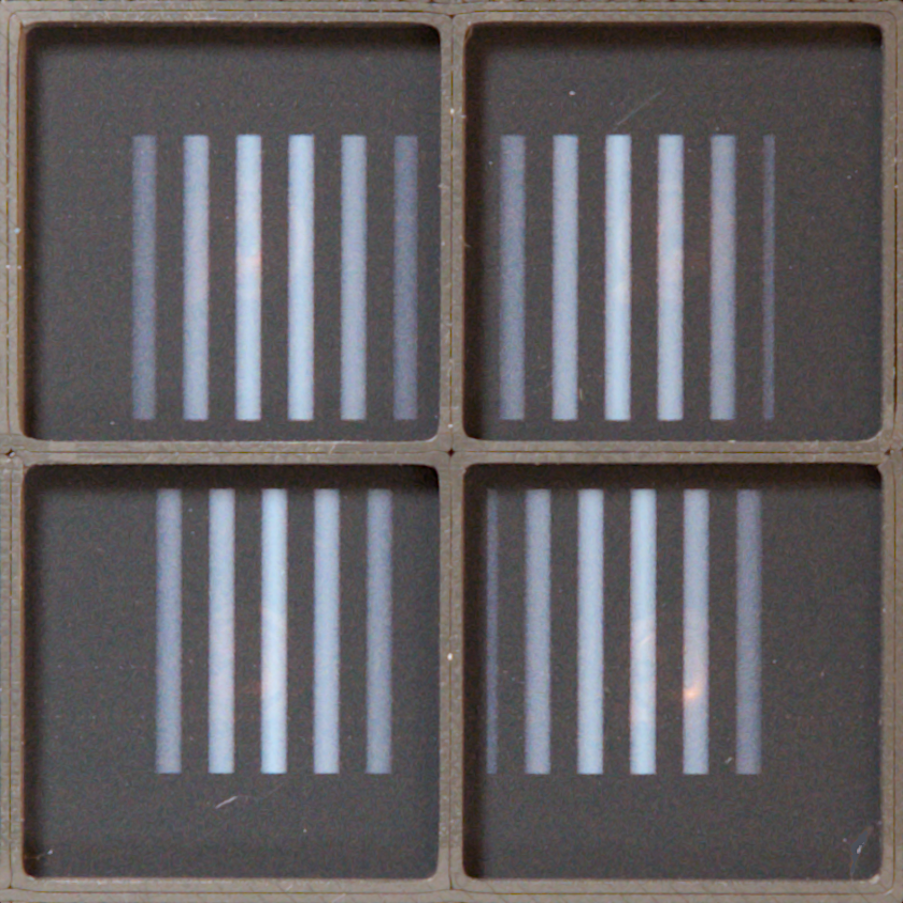
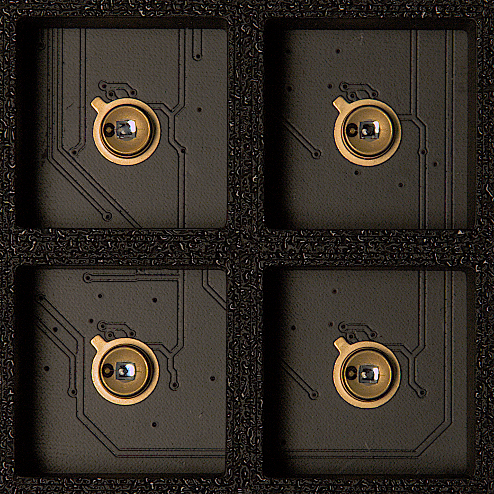
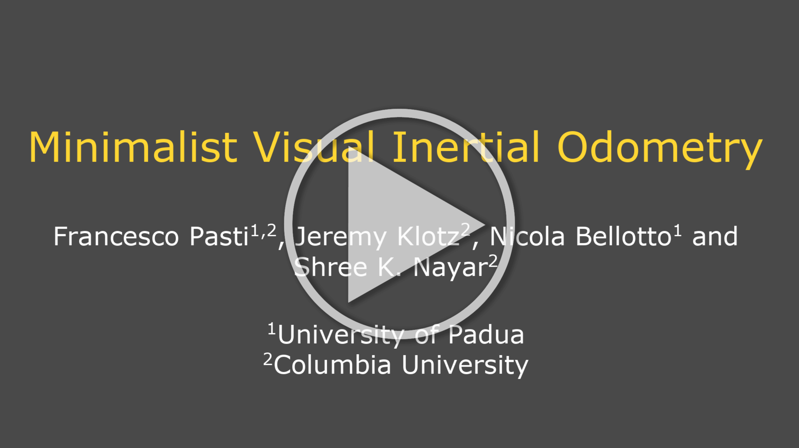

<div align="center">

# Minimalist Visual Inertial Odometry

**Odometry with just 4-pixel and an IMU**

[**Installation**](#installation) • [**Quick Start**](#quick-start) • [**Paper**](#citation) • [**Project Video**](#project-video)

We built a sensor consisting of 4 masked photodiodes, where each photodiode produces a single scalar value. We model the mask transmittance as Gabor functions, i.e., a sinusoid modulated by a Gaussian envelope. Then, as the sensor moves across arbitrary textures, the measurements from the masked photodiodes robustly encode the linear velocity of the robot. 

Pairing this measurement with the angular velocity from an IMU gives the full planar odometry of the sensor.  

For more details, refer to the [paper](#citation).


</div>
<br>
<video src="https://github.com/user-attachments/assets/2a471b57-9d47-4ab7-9e7b-6f7eafe94053" autoplay loop muted playsinline></video>

## Sensor Simulation Overview

The simulator generates the four photodiode views during motion.

Then, the effects of the finite area (b), the directional response (D), and the foreshortening effect (Ω) of the photodiodes are applied to each view. The result is then integrated (Σ) before simulating the electronic response of each photodiode by applying gain (G), read and quantization noise, and saturation. 

Finally, two signals, $s_{cos}(t)$ and $s_{sin}(t)$, are computed and fed into a Temporal Convolutional Network (TCN). The TCN takes a temporal window of the input signals to predict the linear velocity $\hat{v}_x(t)$ of the sensor. 

Since the simulator is **fully differentiable**, the loss is backpropagated to optimize not just the TCN but also the Gabor mask parameters ($\xi_0, \sigma, \alpha$).

<br>
<video src="https://github.com/user-attachments/assets/97fcd999-3e56-4c83-bb00-0d783d5a3c80" autoplay loop muted playsinline></video>


## Installation

### Python Environment
```bash
# 1. Clone the repository
git clone https://github.com/pastifra/four-pixel-vio.git
cd four-pixel-vio

# 2. Create the environment
conda env create -f environment.yml

# 3. Activate the environment
conda activate four-pixel-vio
```

### Data
To generate data, the simulator uses robot trajectories from Tartan and high-resolution texture images from Matador.

Download the Matador images and Tartan trajectories:
```bash
wget coming soon
```

To download a larger set of Tartan trajectories, refer to [TartanAir/TartanGround](https://tartanair.org/tartanground.html)

For more info on Matador images, refer to the [Matador website](https://cave.cs.columbia.edu/repository/Matador)

## Quick Start

### Simulator Tutorial
To understand the pipeline, we recommend going through the Jupyter Notebook. It covers everything from instantiating the simulated sensors to an example of the final integrated trajectory.

```bash
jupyter notebook tutorial.ipynb
```

### Training

You can train the TCN decoder based on a sensor and simulator model defined in ```data/configs/demo_cfg.yml```. You can customize the simulator parameters by creating your own version of this file, which contains detailed comments explaining all the simulator parameters.

```bash
# 1. Activate the environment
conda activate four-pixel-vio

# 2. Train
python train.py --configs data/configs/demo_cfg.yml

# 3. Monitor progress during training
tensorboard --logdir data/logs
```

### Masks

You can visualize a high-resolution version of the trained masks, ready to be printed on transparency film.

Change the paths in ```masks-printing/mask_model.yml``` if you want to visualize the masks of a model different from the demo model.

```bash
cd masks-printing

python mask_printing.py -d 1200 -t model --mask_fov 70 --model_list_file mask_model.yml -o mask.png
```

<div align="center">

| <br>**a) Masks** | <br>**b) Photodiodes** |
| :---: | :---: |

<p><em>(a) Example of trained masks printed on transparency film. (b) Hamamatsu S9119-01 used for the simulator physical parameters (solid angle, directivity, inter-detector distance, FOV, etc.)</em></p>

</div>


## Repository Structure
```bash
four-pixel-vio/
├── data/                 # Training configurations, pre-trained TCN model, and hardware transfer functions
├── masks-printing/       # Visualization tools 4-Pixel masks
├── simulator/            # Core simulator physics and rengering engine
│   ├── cam_models.py     # 4-Pixel sensor simulator and TCN decoder
│   └── views_simulator.py # 4-Pixel views simualtor
├── utils/                
├── environment.yml       
├── train.py              # Main training loop for the TCN velocity decoder
└── tutorial.ipynb        # Interactive tutorial of the simulator
```

## Project Video
<div align="center">
<a href="https://cave.cs.columbia.edu/old/projects/minvio/videos/minvio_website.mp4" target="_blank">
  
</a>
<p><em> The video walks through the project. It covers the theoretical intuition behind the sensor, the design of the physically-grounded simulator, and the experimental evaluation across diverse indoor and outdoor terrains. </em></p>
</div>


## Citation
```bibtex
@inproceedings{pasti2026minimalistodometry,
  title        = {Minimalist Visual Inertial Odometry},
  author       = {Francesco Pasti and Jeremy Klotz and Nicola Bellotto and Shree K. Nayar},
  year         = {2026}
}
```


